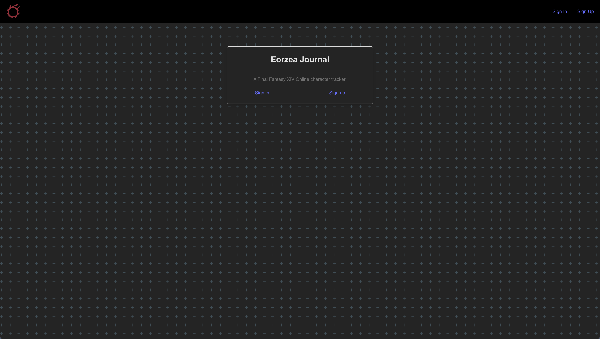
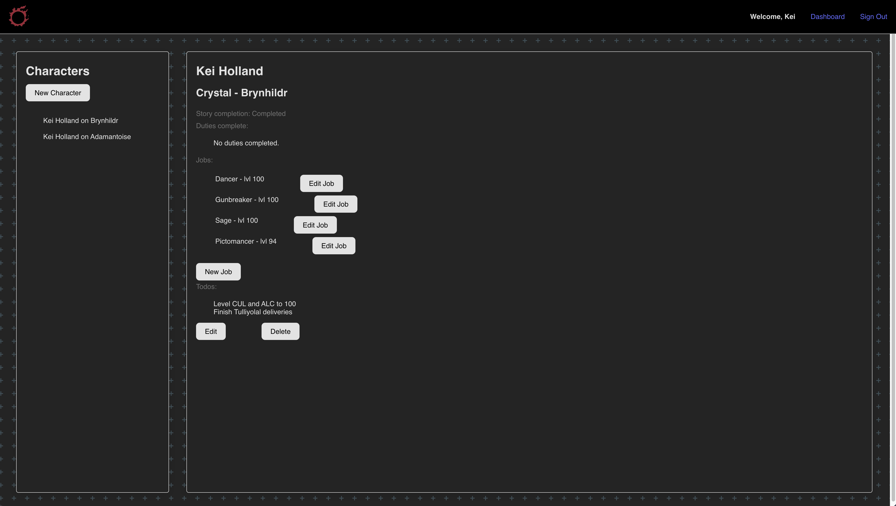
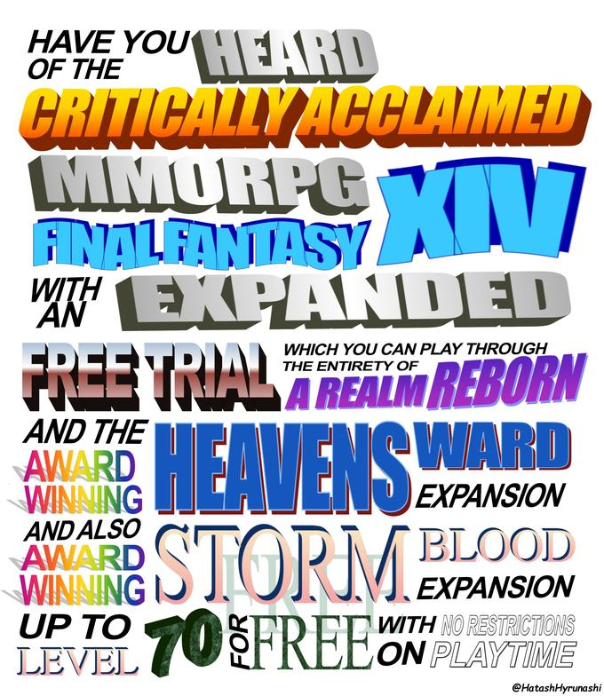

# Eorzea Journal
An app to track your progress on your Final Fantasy XIV Online characters.

*Silly little catbois do silly little catboi things in silly little catboi land...* and forgets what those silly little catboi things are 'cuz he has adhd and this game is over a decade old. The UI doesn't help. If I don't help anyone else, I hope I can get my own tasks together.

### Getting started

[Link to deployed app](https://eorzea-journal.netlify.app/)\
[Do you care about the API powering this? Here's the repo.](https://github.com/kei-the-gae/eorzea-journal-api.git)\
 API hosted here\
[Planning materials](https://trello.com/b/VwoPUVHQ/ffxiv-tracker)

>Have you heard of the critically acclaimed MMORPG Final Fantasy XIV? With an expanded free trial which you can play through the entirety of A Realm Reborn and the award-winning Heavensward and also award-winning Stormblood expansion up to level 70 for free with no restrictions on playtime!

All hail to Yoshi-P and my favorite game of all time

### Technologies

\

### Stretch goals
- Didn't manage to make it to adding todos properly - the routes exist in the API for the todos and the schema exists but don't have a way to add them on the front end.

- Completed duties required me to handwrite every single duty in the game into the database or find a way to pull them from the Lodestone. As of the time I'm turning this project in there are 349 duties in the game. I did not have the time nor energy. It shows up in the character though as an empty array for future expansion.

- Add ability to track crafting recipes, item gathering progress, fish caught

- *HEY LITTLE GREMLIN, REMEMBER YOUR WEEKLIES YET?*

- Add ability to track  one off tasks like the deliveries for each expansion since Shb

- Add relic tracker. God knows the ARR relic grind is real. IYKYK.

- Adding characters via Lodestone data also wouldn't be a bad idea. I'm pretty sure there's an API for that floating around, given the Discord bots and websites that pull character data from there. That would allow for dynamic images of characters as well as an ability to import data about the character, job levels, duties complete etc etc.
